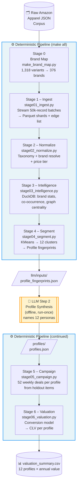
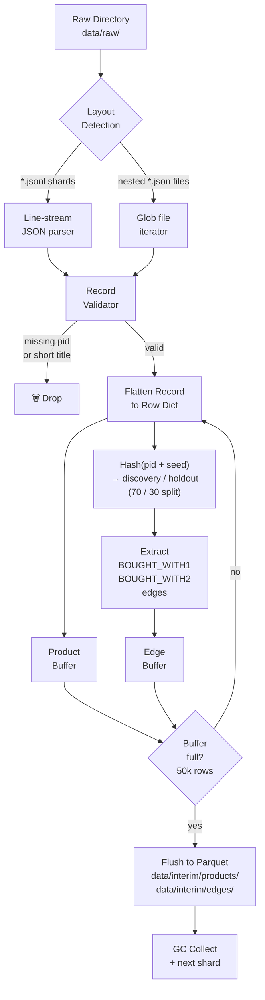
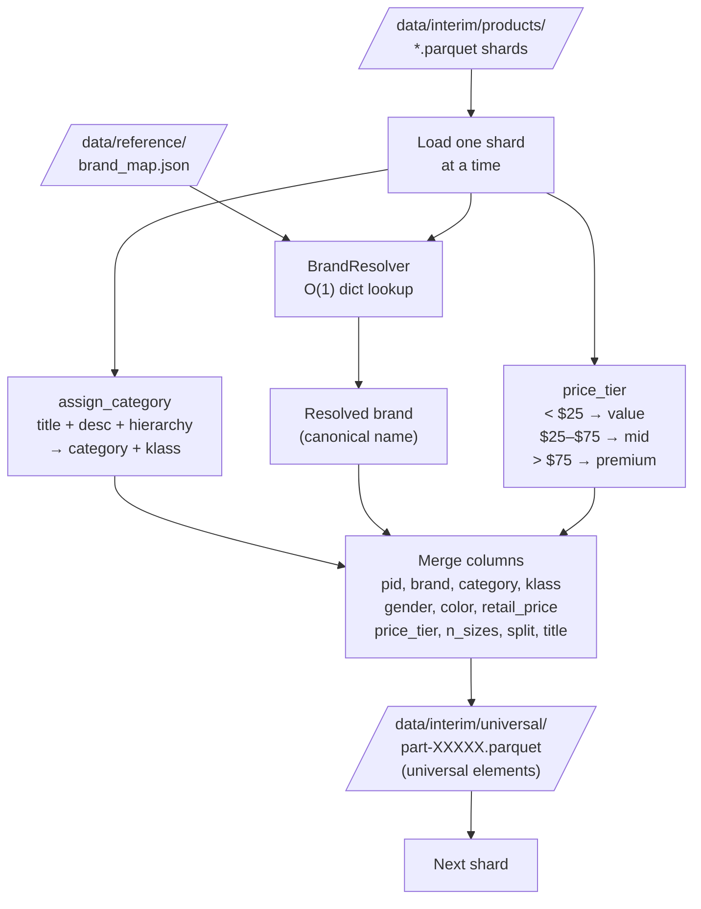
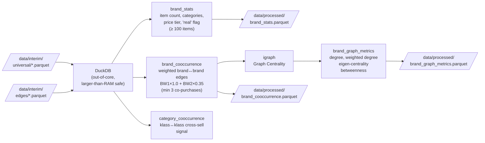
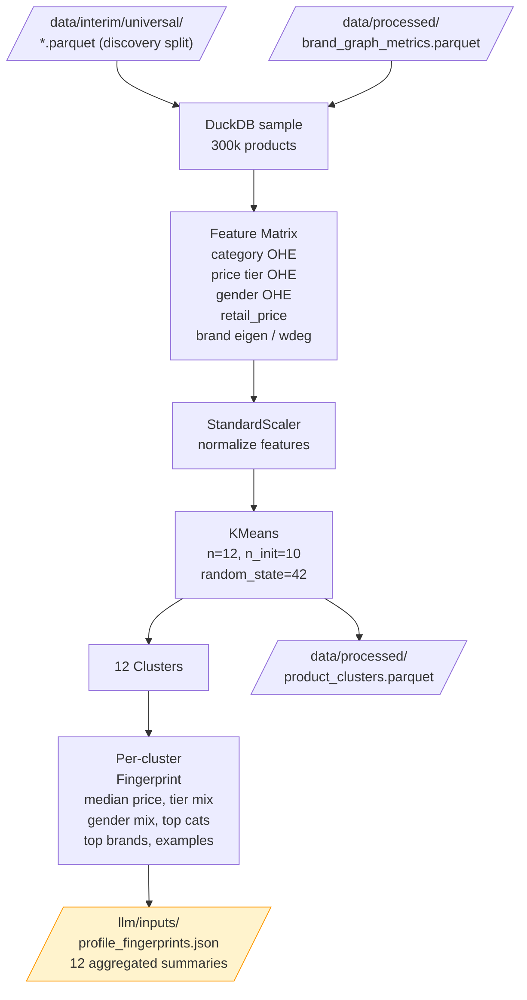
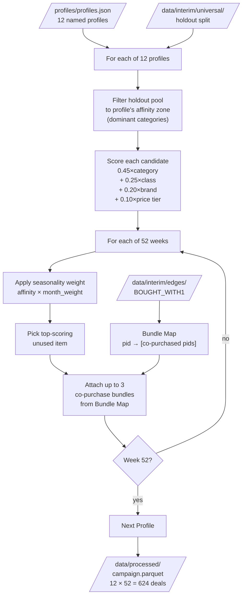
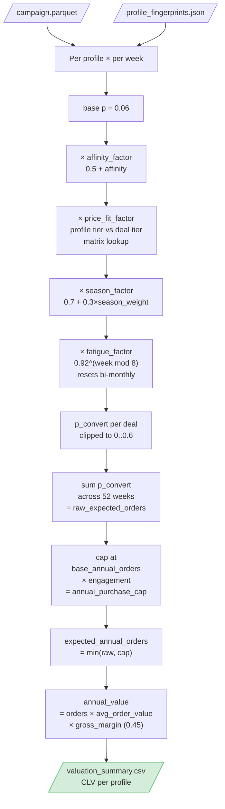
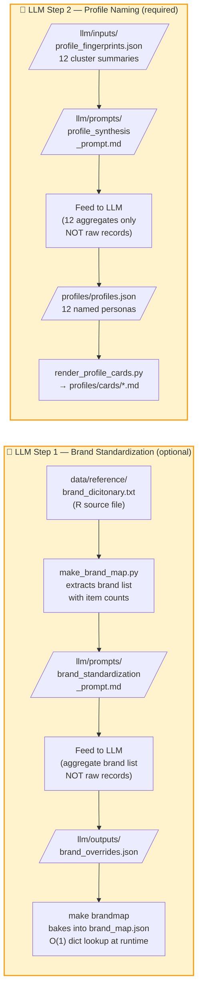

# Amazon Apparel → Customer Profiles → Year-Long Deal Campaign

> Graduate capstone pipeline that turns a millions-of-records Amazon apparel JSON corpus into **12 distinct named customer profiles** and a **52-week deal campaign per profile** with conversion estimates and an **annual customer value (CLV proxy)**.

Runs locally on a normal laptop (8–16 GB RAM). The runnable codebase makes **zero LLM/API calls** and is fully deterministic. LLMs are used only for two offline, aggregate-only steps (brand standardization, profile naming), with prompts + outputs saved as artifacts.

---

## Table of Contents

- [Quick Start](#quick-start)
- [Pipeline Overview](#pipeline-overview)
- [Detailed Flow Diagrams](#detailed-flow-diagrams)
  - [Stage 1 – Ingest](#stage-1--ingest)
  - [Stage 3 – Intelligence (Brand Graph)](#stage-3--intelligence-brand-graph)
  - [Stage 4 – Segmentation](#stage-4--segmentation)
  - [Stage 5 – Campaign Generation](#stage-5--campaign-generation)
  - [Stage 6 – Valuation (CLV Model)](#stage-6--valuation-clv-model)
  - [LLM Integration Points](#llm-integration-points)
- [Presentation](#presentation)
- [Repository Layout](#repository-layout)
- [Key Design Decisions](#key-design-decisions)
- [Outputs](#outputs)
- [Limitations](#limitations)

---

## Quick Start

```bash
pip install -r requirements.txt

# Option A — smoke test the whole pipeline on synthetic data (no download needed):
make smoke

# Option B — real run (requires the corpus):
python scripts/download_data.py --folder <GOOGLE_DRIVE_FOLDER_URL>   # -> data/raw/
make all                                                              # -> data/processed/
```

`make all` runs: `brandmap → ingest → normalize → intel → segment → campaign → value`

Final results land in `data/processed/valuation_summary.csv`.

---

## Pipeline Overview



---

## Detailed Flow Diagrams

### Stage 1 – Ingest



### Stage 2 – Normalize



### Stage 3 – Intelligence (Brand Graph)



### Stage 4 – Segmentation



### Stage 5 – Campaign Generation



### Stage 6 – Valuation (CLV Model)



### LLM Integration Points



---

## Presentation

The capstone presentation is available as a PowerPoint file at [presentation/Amazon_Apparel_Capstone.pptx](presentation/Amazon_Apparel_Capstone.pptx).

It was generated programmatically from the pipeline data using [`presentation/build_ppt.js`](presentation/build_ppt.js) (Node.js + pptxgenjs). To regenerate it:

```bash
cd presentation
npm install
node build_ppt.js
```

### Slide Outline (15 slides)

| # | Slide | Coverage |
|---|-------|----------|
| 1 | **Cover** | Project title, 4 headline stats |
| 2 | **Problem & Framing** | Business problem, our framing, end-to-end pipeline flow |
| 3 | **The Data** | Record schema, two relationship signals (BW1/BW2), noise challenge, 70/30 split |
| 4 | **Handling Scale** | Streaming ingest, DuckDB out-of-core, disk-persisted intermediates |
| 5 | **Intelligence Layers** | Taxonomy, brand standardization, relationship graph — side by side |
| 6 | **Segmentation** | 5-step flow from products → 12 taste neighborhoods |
| 7 | **12 Profiles Grid** | All 12 profiles with derived names, tier, categories, brands, catalogue share |
| 8 | **Profile Deep-Dives** | Outerwear Enthusiast · Fitness-Forward Woman · Everyday Denim Dad |
| 9 | **Campaign Design** | Affinity scoring formula, seasonality logic, output schema |
| 10 | **Cadence vs Frequency** | 52 offers ≠ 52 purchases — fatigue decay and annual purchase cap |
| 11 | **Conversion Model** | 5-factor model: base × affinity × price-fit × season × fatigue |
| 12 | **Valuation Table** | All 12 profiles sorted by CLV with avg order value and expected orders |
| 13 | **Results at a Glance** | 6 headline KPIs + standout deals |
| 14 | **Limitations** | No transaction log · forced k=12 · holdout stub · assumption-driven priors |
| 15 | **Appendix** | Repo layout, reproducibility, config.yaml parameters |

---

## Repository Layout

```
amazon-apparel-capstone/
├── README.md               ← you are here
├── Makefile                ← make smoke / make all / make clean
├── requirements.txt
├── config.yaml             ← all tunable parameters (batch size, margins, tiers…)
│
├── src/
│   ├── config.py           ← loads config.yaml once → CFG dict
│   ├── taxonomy_assign.py  ← keyword-based category/class assignment
│   ├── brand_resolve.py    ← O(1) brand_map.json lookup
│   ├── seasonality.py      ← per-category month_weights
│   ├── stage01_ingest.py
│   ├── stage02_normalize.py
│   ├── stage03_intelligence.py
│   ├── stage04_segment.py
│   ├── stage05_campaign.py
│   └── stage06_valuation.py
│
├── scripts/
│   ├── make_brand_map.py       ← build brand_map.json from R dict + LLM overrides
│   ├── download_data.py        ← fetch corpus from Google Drive
│   ├── make_synthetic_corpus.py← generate synthetic data for smoke tests
│   └── render_profile_cards.py ← profiles.json → profiles/cards/*.md
│
├── data/
│   ├── raw/            # corpus (gitignored — too large)
│   ├── interim/        # parquet shards: products/, edges/, universal/ (gitignored)
│   ├── processed/      # final artifacts: brand_stats, campaign, valuation…
│   └── reference/      # taxonomy.py, brand_dicitonary.txt, brand_map.json
│
├── llm/
│   ├── prompts/        # brand_standardization_prompt.md, profile_synthesis_prompt.md
│   ├── inputs/         # profile_fingerprints.json (fed to LLM)
│   └── outputs/        # saved LLM responses (reproducibility)
│
├── profiles/
│   ├── profiles.json   # 12 named personas (LLM output)
│   └── cards/          # cluster_00.md … cluster_11.md (human-readable)
│
├── campaign/           # optional per-profile campaign exports
├── tests/              # pytest sanity checks
└── presentation/       # slide outline
```

---

## Key Design Decisions

| Decision | Why |
|----------|-----|
| **Stream ingest in 50k batches** | Corpus can be millions of records; fixed batch size keeps RAM flat on any machine |
| **70 / 30 discovery / holdout split** | Profiles are *discovered* on one half; weekly deals are *operated* on the other — no data leakage |
| **Two relationship signals** | `BOUGHT_WITH1` ("also bought", weight 1.0) is the backbone; `BOUGHT_WITH2` ("considered/liked", weight 0.35) adds signal but is down-weighted |
| **Real-brand floor (≥ 100 items)** | ~80k raw brand strings collapse to a few thousand real brands; long-tail noise is excluded from graph intelligence |
| **KMeans forced to 12** | Guarantees exactly 12 profiles as required; HDBSCAN would let count emerge organically (noted as a limitation) |
| **LLM offline only** | LLM never sees raw records — only 12 aggregated fingerprints. Every deterministic stage is reproducible with zero tokens |
| **Cadence ≠ frequency** | 52 weekly *offers* are generated, but expected annual *purchases* are capped realistically and decayed for offer fatigue |

---

## Outputs

| Artifact | Location | Description |
|----------|----------|-------------|
| Brand stats | `data/processed/brand_stats.parquet` | Item count, category breadth, price tier per brand |
| Brand co-occurrence | `data/processed/brand_cooccurrence.parquet` | Weighted brand↔brand purchase graph |
| Graph metrics | `data/processed/brand_graph_metrics.parquet` | Degree, eigen-centrality, betweenness per brand |
| Product clusters | `data/processed/product_clusters.parquet` | pid → cluster_id mapping |
| Profile fingerprints | `llm/inputs/profile_fingerprints.json` | 12 quantitative cluster summaries |
| Named profiles | `profiles/profiles.json` | 12 LLM-generated personas |
| Profile cards | `profiles/cards/cluster_XX.md` | Human-readable profile markdown |
| Campaign | `data/processed/campaign.parquet` | 12 × 52 deals with affinity + seasonality scores |
| Conversion detail | `data/processed/conversion_cluster_XX.parquet` | Per-deal conversion probability per profile |
| Valuation summary | `data/processed/valuation_summary.csv` | CLV estimate per profile |

---

## Limitations


- **No transaction log** — conversion is a *modelled, defended* estimate, not a measurement. All assumptions are in `config.yaml`.
- **KMeans forces exactly 12 clusters** — HDBSCAN would let the cluster count emerge from the data.
- **Holdout centroid-assignment is stubbed** — non-sampled products are not formally assigned to clusters in stage 4.
- **Seasonality, margin, and frequency priors are assumptions** — they are tunable in `config.yaml` but not validated against actuals.
- **Brand standardization is best-effort** — the R dictionary + optional LLM overrides do not cover every variant.
